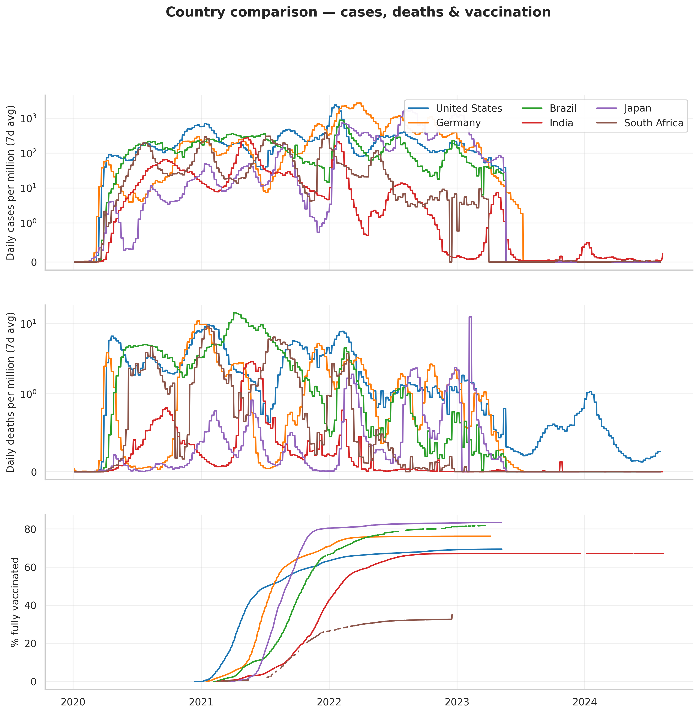

# COVID-19 Trends Dashboard

An end-to-end data analysis project exploring the global COVID-19 pandemic through cases, vaccinations, mortality, and government response. Built with **pandas**, **matplotlib**, and **seaborn**.

The dashboard generates 10 publication-ready charts that surface insights ranging from global wave patterns and vaccination inequity to one of the pandemic's most important untold stories: the **gap between reported COVID deaths and true excess mortality.**

---

## What this project answers

1. **How did the pandemic unfold globally?** Wave detection on the smoothed daily-case curve.
2. **Who got hit hardest, per capita?** Per-million rankings — which surface a different set of countries than raw case counts.
3. **How did continents compare over time?** Side-by-side new-cases trajectories.
4. **How equitable was the vaccine rollout?** GDP per capita vs full-vaccination coverage.
5. **Did case fatality rates change as treatment improved?** CFR timeline with proper caveats about reporting bias.
6. **What's the *true* mortality toll?** Excess mortality vs reported COVID deaths — exposing significant undercounts.
7. **Did government response (stringency) track with case loads?** Stringency index overlaid on cases.

---

## Sample outputs

### Global waves


### Vaccination coverage — highest vs lowest


### Wealth vs vaccination — the equity divide


### Excess mortality vs reported COVID deaths
The most striking finding in the dataset: for many countries (Russia, Bulgaria, Serbia, South Africa), all-cause excess deaths are **2–3× higher** than reported COVID deaths.


### Country-by-country comparison


The full set of 10 charts lives in [`outputs/`](outputs/).

---

## Project structure

```
covid-dashboard/
├── README.md
├── requirements.txt
├── LICENSE
├── .gitignore
├── src/
│   ├── data_loader.py       # Download + cache + clean the OWID dataset
│   ├── analysis.py          # Derived metrics, wave detection, summaries
│   ├── visualizations.py    # All 10 plot functions
│   └── dashboard.py         # Main entry point — runs everything
├── notebooks/
│   └── covid_analysis.ipynb # Interactive walkthrough
├── data/                    # Auto-populated cache (gitignored)
└── outputs/                 # Generated PNGs
```

---

## Quickstart

```bash
# 1. Clone
git clone https://github.com/<your-username>/covid-dashboard.git
cd covid-dashboard

# 2. (Recommended) Create a virtual environment
python -m venv venv
source venv/bin/activate          # on Windows: venv\Scripts\activate

# 3. Install dependencies
pip install -r requirements.txt

# 4. Run the dashboard
python src/dashboard.py
```

The first run downloads the dataset (~94 MB) and caches it under `data/`. Subsequent runs use the cache. Use `--refresh` to force re-download:

```bash
python src/dashboard.py --refresh
```

Charts are saved to `outputs/` at 300 DPI — they're sharp enough to drop into reports or presentations.

To explore the data interactively, launch Jupyter:

```bash
jupyter notebook notebooks/covid_analysis.ipynb
```

---

## Key findings

Some highlights surfaced by the analysis (figures from the OWID dataset, dated **14 Aug 2024** — the dataset's final update):

- **Global toll:** ~775M reported cases, ~7.0M reported COVID deaths, 64.9% of the global population fully vaccinated.
- **Most-affected by reported cases per capita:** Austria, South Korea, and Slovenia top the list — but this largely reflects testing intensity, not infection prevalence.
- **Vaccination inequity:** Countries with GDP per capita above $35k average ~75% full vaccination; countries below $5k average under 35%.
- **Mortality undercount:** Excess mortality in Bulgaria and Russia exceeds 9,000 deaths per million — roughly 1.7× and 3.4× their reported COVID death rates respectively.
- **Convergence post-Omicron:** Reported CFR for most large economies dropped from 3–5% in 2020 to under 1.5% by mid-2022 as vaccines, treatment, and milder Omicron variants took hold.

---

## A note on the data

Source: [Our World in Data — COVID-19 dataset](https://github.com/owid/covid-19-data).

OWID stopped daily updates of this dataset in **August 2024**, so this represents a complete snapshot of the pandemic record rather than a live tracker. The dataset itself remains the standard reference for academic and journalistic analysis.

### Known data quirks the code accounts for
- **Aggregate rows** (e.g. `World`, `Africa`, `European Union`) are flagged by a missing `continent` value and split out from country rows.
- **Sparse reporting cadences** — different metrics update on different schedules. Code uses last-non-null values per metric, not just the last row.
- **Early-pandemic CFR noise** — the chart filters out pre-April-2020 data, when reporting lag between cases and deaths produced impossible CFR values >100%.
- **China's December 2022 reporting jump** — a single huge spike in the global curve corresponds to reclassification after dropping zero-COVID, not a real one-day surge.

---

## What I learned building this

- **Splitting aggregates from countries early** prevents subtle double-counting in continental and global summaries — a class of bug that's easy to miss.
- **Per-capita metrics tell different stories than raw counts** — and both are reporting-biased.
- **Excess mortality** is far more honest than reported COVID deaths for cross-country comparison. Most pandemic dashboards leave it out.
- **Smoothing matters** — raw daily counts are dominated by weekly reporting cycles; 7-day rolling averages are the minimum for legibility.

---

## Possible extensions

- **Interactive Plotly/Dash version** for live filtering by country and date range
- **Choropleth maps** using GeoPandas or Folium for geographic intuition
- **Forecasting** — fit an SIR / SEIR model or a simple Prophet model and compare predictions to actuals
- **Variant overlay** — annotate when Alpha, Delta, and Omicron emerged in each region
- **Hospitalization analysis** — the dataset has ICU and hospital occupancy data that isn't visualized here

---

## License

MIT — see [LICENSE](LICENSE).
