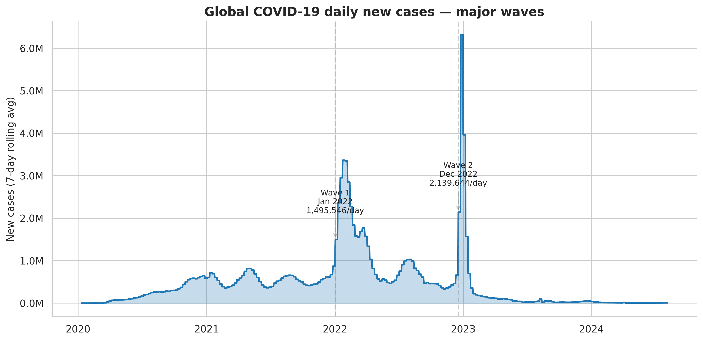
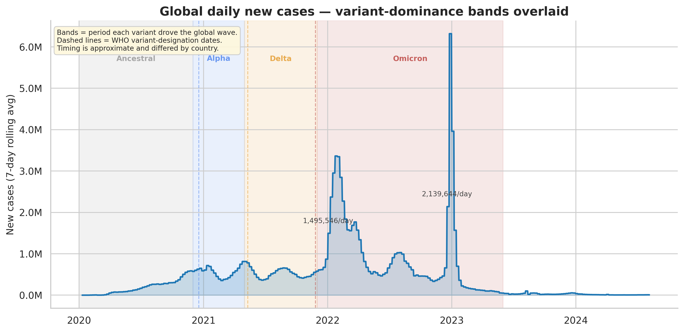
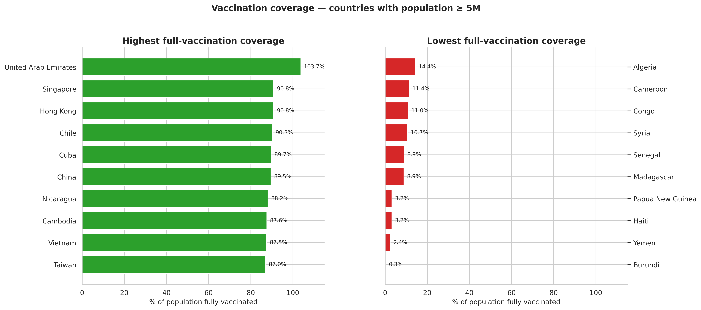
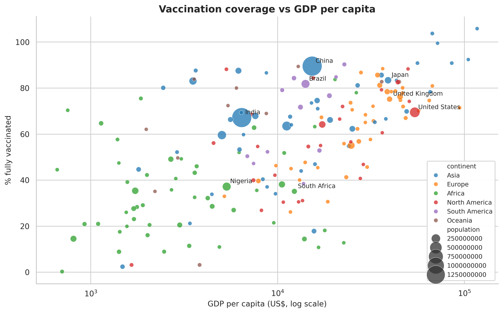
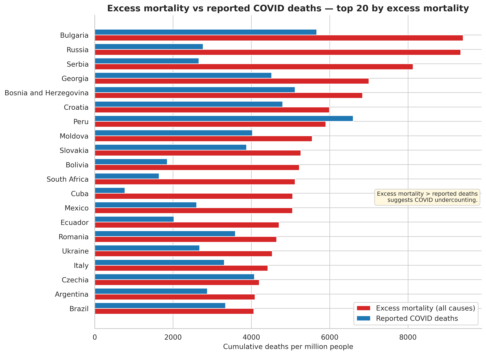
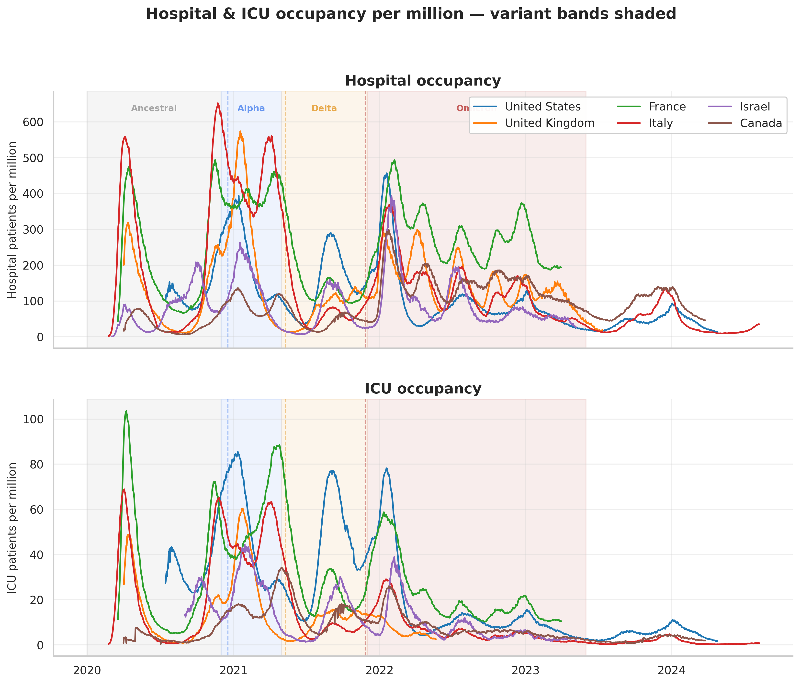
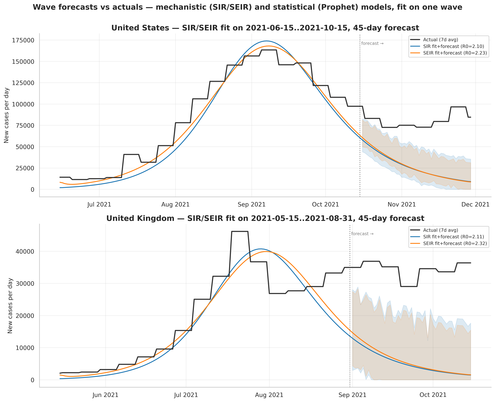

# COVID-19 Trends Dashboard

An end-to-end data analysis project exploring the global COVID-19 pandemic through cases, vaccinations, mortality, hospitalization, and government response. Built with **pandas**, **matplotlib**, **seaborn**, **scipy**, **Plotly**, and **Dash**.

The project ships in three forms:

- **A static dashboard** — 14 publication-ready charts generated by one command.
- **An interactive Dash app** — live filtering by country and date range, a world choropleth map, and on-the-fly SIR/SEIR (and optional Prophet) forecasting.
- **A Jupyter notebook** — an interactive walkthrough of the analysis.

Insights range from global wave patterns and vaccination inequity to one of the pandemic's most important untold stories: the **gap between reported COVID deaths and true excess mortality.**

---

## What this project answers

1. **How did the pandemic unfold globally?** Wave detection on the smoothed daily-case curve — now also overlaid with variant-dominance bands.
2. **Who got hit hardest, per capita?** Per-million rankings — which surface a different set of countries than raw case counts.
3. **How did continents compare over time?** Side-by-side new-cases trajectories.
4. **How equitable was the vaccine rollout?** GDP per capita vs full-vaccination coverage.
5. **Did case fatality rates change as treatment improved?** CFR timeline with proper caveats about reporting bias.
6. **What's the *true* mortality toll?** Excess mortality vs reported COVID deaths — exposing significant undercounts.
7. **Did government response (stringency) track with case loads?** Stringency index overlaid on cases.
8. **How did hospitals and ICUs fill up?** Hospital + ICU occupancy per million, with variant bands for context.
9. **Which variant drove which wave?** Variant emergence timeline overlaid on the global case curve.
10. **Can simple models forecast a wave?** SIR/SEIR compartmental models and Prophet fit to single waves, projected forward and checked against what actually happened.
11. **What does the pandemic look like on a map?** Interactive world choropleths for any metric, at any date.

---

## The interactive Dash app

```bash
python interactive/app.py
# then open http://127.0.0.1:8050
```

Three tabs, all driven by a shared country multi-select and date-range slider:

- **Time series** — one line per selected country for any metric (cases, deaths, vaccination, hospital/ICU occupancy, stringency), with optional variant-band overlay and log y-axis.
- **World map** — a Plotly choropleth for any metric, with a date slider that snapshots each country's latest value as of that date.
- **Forecast** — fits the SIR and SEIR compartmental models *live* to whatever date window you've selected for a focus country (plus Prophet, if it's installed), then projects forward. Each forecast is plotted against the actual subsequent data so you can see where the different model families break down.

The app loads the dataset once at startup; callbacks only filter, so the UI stays responsive.

---

## Sample outputs (static dashboard)

### Global waves


### Global waves with variant bands


### Vaccination coverage — highest vs lowest


### Wealth vs vaccination — the equity divide


### Excess mortality vs reported COVID deaths
The most striking finding in the dataset: for many countries (Russia, Bulgaria, Serbia, South Africa), all-cause excess deaths are **2–3× higher** than reported COVID deaths.


### Hospital & ICU occupancy


### Wave forecasts vs actuals (SIR / SEIR / Prophet)


The full set of charts lives in [`outputs/`](outputs/). The choropleth is written as an interactive `.html` file (and a `.png` too, if `kaleido` is installed).

---

## Project structure

```
covid-dashboard/
├── README.md
├── requirements.txt
├── LICENSE
├── .gitignore
├── src/
│   ├── data_loader.py          # Download + cache + clean the OWID dataset
│   ├── analysis.py             # Derived metrics, wave detection, summaries
│   ├── visualizations.py       # The original 10 plot functions
│   ├── visualizations_extra.py # Charts 11–13: hospitalization, variant overlay, forecast
│   ├── variants.py             # Variant emergence timeline + overlay helpers (shared)
│   ├── choropleth.py           # Plotly choropleth maps (shared with the Dash app)
│   └── dashboard.py            # Main entry point — runs everything
├── models/
│   ├── epidemic_models.py      # SIR / SEIR compartmental models + fitting
│   └── prophet_model.py        # Prophet statistical forecaster (optional dep)
├── interactive/
│   └── app.py                  # Plotly Dash app — live filtering, map, forecasting
├── notebooks/
│   └── covid_analysis.ipynb    # Interactive walkthrough
├── data/                       # Auto-populated cache (gitignored)
└── outputs/                    # Generated charts (PNGs + choropleth HTML)
```

### Why the folder split?

- `src/` is the static-analysis pipeline. `variants.py` and `choropleth.py` live here because they're imported by *both* the static dashboard and the Dash app — they're shared library code, not app code.
- `models/` is standalone — the forecasting models don't import anything from `src/`, so they're reusable on their own. `epidemic_models.py` is dependency-light (numpy + scipy); `prophet_model.py` needs the optional `prophet` package and guards its import, so the rest of `models/` works whether or not Prophet is installed.
- `interactive/` is the Dash app and nothing else. It imports from `src/` and `models/` but nothing imports from it.

---

## Quickstart

```bash
# 1. Clone
git clone https://github.com/skerk001/covid-dashboard.git
cd covid-dashboard

# 2. (Recommended) Create a virtual environment
python -m venv venv
source venv/bin/activate          # on Windows: venv\Scripts\activate

# 3. Install dependencies
pip install -r requirements.txt

# 4a. Run the static dashboard (generates all charts)
python src/dashboard.py

# 4b. ...or launch the interactive app
python interactive/app.py
```

The first run downloads the dataset (~94 MB) and caches it under `data/`. Subsequent runs use the cache. Use `--refresh` to force re-download:

```bash
python src/dashboard.py --refresh
```

Other flags:

```bash
python src/dashboard.py --skip-extras   # only the original charts 01–10
python src/dashboard.py --outdir path/  # custom output directory
```

To explore the data interactively in Jupyter:

```bash
jupyter notebook notebooks/covid_analysis.ipynb
```

---

## A note on the forecasting models

The project ships **three** forecasting models, in two families:

**Mechanistic — `models/epidemic_models.py`** fits **SIR** and **SEIR** compartmental models with scipy's least-squares optimiser. These need only numpy + scipy, and their fitted parameters (β, γ, implied R₀) are epidemiologically interpretable.

**Statistical — `models/prophet_model.py`** fits **Prophet**, a generalised additive model (trend + weekly seasonality). It knows nothing about epidemics — it's curve-fitting — but it's a useful contrast to the mechanistic models because it fails *differently*.

Prophet is an **optional dependency**: it pulls in cmdstanpy and a compiler toolchain, so it's deliberately kept out of the core requirements. If Prophet isn't installed, the SIR/SEIR models still run and the forecast chart/tab simply omit the Prophet line — nothing else breaks. Install it with `pip install prophet`.

All three expose the **same `.forecast()` contract** — a tidy DataFrame with `date`, `kind`, `new_cases`, `lower`, `upper` — so the static chart and the Dash tab treat them interchangeably.

**Important caveats** (also documented in the module docstrings):

- A constant-parameter compartmental model **cannot** reproduce multi-wave dynamics — interventions, behaviour change, seasonality, and variants all shift β over time. All three models are therefore fit to a **single wave window**, not the whole pandemic.
- "Reported cases" ≠ "true infections." The SIR/SEIR fit targets the *shape* of the reported curve and uses an `ascertainment` knob for the susceptible pool; absolute compartment sizes are only loosely identifiable.
- Prophet will extrapolate a trend off a cliff — on a wave past its peak the linear trend can go negative, so the forecast tail defaults to a flat trend and is clipped at zero. Its weekly seasonality is mostly a reporting artefact (weekend test-centre closures), not transmission.
- The forecast intervals — residual bootstrap for SIR/SEIR, trend simulation for Prophet — are rough indications that uncertainty exists, not calibrated posteriors.

The forecast charts plot predictions against actuals precisely so you can *see* where each model breaks: the mechanistic models overshoot once real-world behaviour adapts, Prophet over-trusts the local trend. Those gaps are the lesson, not a bug.

---

## A note on the variant timeline

`src/variants.py` carries approximate windows for when each variant (Ancestral, Alpha, Delta, Omicron) drove the global wave, plus WHO designation dates. These are for **annotation**, not epidemiological precision — variant timing differed substantially by country, and OWID's main dataset doesn't carry per-country variant sequencing (that's a [separate OWID file](https://github.com/owid/covid-19-data/tree/master/public/data/variants)).

---

## Key findings

Some highlights surfaced by the analysis (figures from the OWID dataset, dated **14 Aug 2024** — the dataset's final update):

- **Global toll:** ~775M reported cases, ~7.0M reported COVID deaths, 64.9% of the global population fully vaccinated.
- **Most-affected by reported cases per capita:** Austria, South Korea, and Slovenia top the list — but this largely reflects testing intensity, not infection prevalence.
- **Vaccination inequity:** Countries with GDP per capita above $35k average ~75% full vaccination; countries below $5k average under 35%.
- **Mortality undercount:** Excess mortality in Bulgaria and Russia exceeds 9,000 deaths per million — roughly 1.7× and 3.4× their reported COVID death rates respectively.
- **Convergence post-Omicron:** Reported CFR for most large economies dropped from 3–5% in 2020 to under 1.5% by mid-2022 as vaccines, treatment, and milder Omicron variants took hold.

---

## A note on the data

Source: [Our World in Data — COVID-19 dataset](https://github.com/owid/covid-19-data).

OWID stopped daily updates of this dataset in **August 2024**, so this represents a complete snapshot of the pandemic record rather than a live tracker. The dataset itself remains the standard reference for academic and journalistic analysis.

### Known data quirks the code accounts for
- **Aggregate rows** (e.g. `World`, `Africa`, `European Union`) are flagged by a missing `continent` value and split out from country rows.
- **Sparse reporting cadences** — different metrics update on different schedules. Code uses last-non-null values per metric, not just the last row.
- **Sparse hospitalization data** — only ~30–40 mostly-high-income countries ever reported hospital/ICU occupancy. The hospitalization chart drops countries with no data rather than failing.
- **Early-pandemic CFR noise** — the chart filters out pre-April-2020 data, when reporting lag between cases and deaths produced impossible CFR values >100%.
- **China's December 2022 reporting jump** — a single huge spike in the global curve corresponds to reclassification after dropping zero-COVID, not a real one-day surge.

---

## What I learned building this

- **Splitting aggregates from countries early** prevents subtle double-counting in continental and global summaries — a class of bug that's easy to miss.
- **Per-capita metrics tell different stories than raw counts** — and both are reporting-biased.
- **Excess mortality** is far more honest than reported COVID deaths for cross-country comparison. Most pandemic dashboards leave it out.
- **Smoothing matters** — raw daily counts are dominated by weekly reporting cycles; 7-day rolling averages are the minimum for legibility.
- **Mechanistic models are honest about their own limits** — a constant-parameter SIR fit visibly fails to predict the next wave, which is itself the most useful thing it can show you.
- **Sharing code between a static pipeline and an interactive app** works cleanly if the shared pieces (variant timeline, choropleth builder) are written as plain library functions that return figures/data, with no I/O or app state baked in.

---

## Possible extensions

- **Choropleth animation** — a play button stepping the map through time, rather than a manual slider
- **Per-country variant shares** — pull OWID's separate variant-sequencing file for true (not approximate) variant overlays
- **Time-varying β** — fit a piecewise or spline β(t) so the compartmental model can span multiple waves
- **Deploy the Dash app** — it already exposes `server` for gunicorn; a Procfile and it's Heroku/Render-ready
- **Hospitalization → severity ratios** — combine ICU occupancy with case counts to estimate how severity shifted across variants

---

## License

MIT — see [LICENSE](LICENSE).
